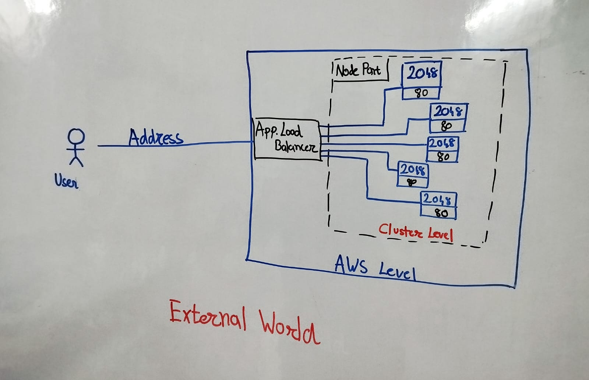
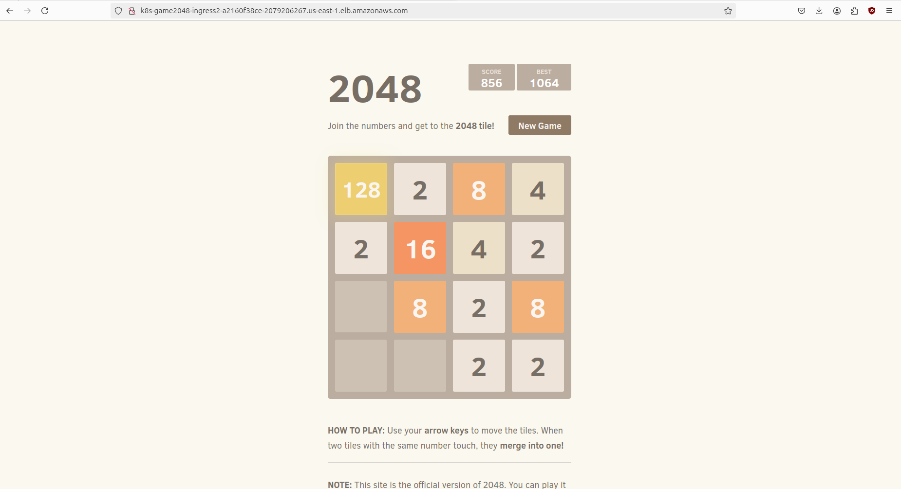
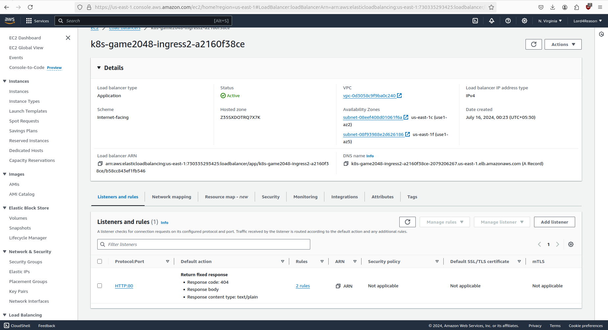
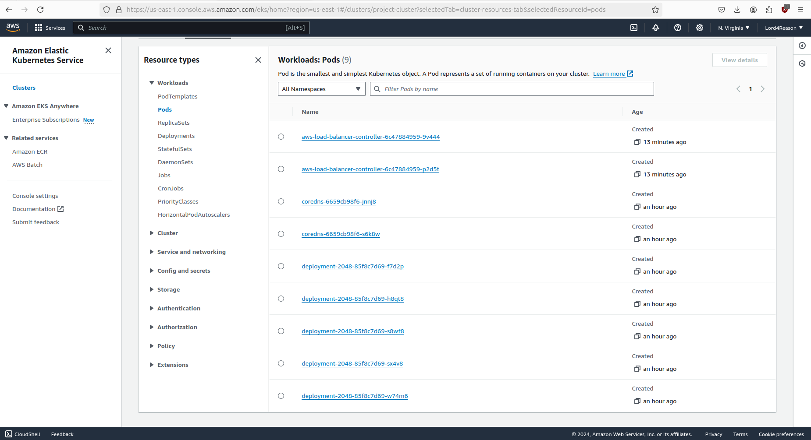

# EKS Fargate Project

This project demonstrates the setup and deployment of a simple application on Amazon EKS (Elastic Kubernetes Service) using Fargate profiles and an AWS Load Balancer Controller.



## YAML File 
```
---
apiVersion: v1
kind: Namespace
metadata:
  name: game-2048
---
apiVersion: apps/v1
kind: Deployment
metadata:
  namespace: game-2048
  name: deployment-2048
spec:
  selector:
    matchLabels:
      app.kubernetes.io/name: app-2048
  replicas: 5
  template:
    metadata:
      labels:
        app.kubernetes.io/name: app-2048
    spec:
      containers:
      - image: public.ecr.aws/l6m2t8p7/docker-2048:latest
        imagePullPolicy: Always
        name: app-2048
        ports:
        - containerPort: 80
---
apiVersion: v1
kind: Service
metadata:
  namespace: game-2048
  name: service-2048
spec:
  ports:
    - port: 80
      targetPort: 80
      protocol: TCP
  type: NodePort
  selector:
    app.kubernetes.io/name: app-2048
---
apiVersion: networking.k8s.io/v1
kind: Ingress
metadata:
  namespace: game-2048
  name: ingress-2048
  annotations:
    alb.ingress.kubernetes.io/scheme: internet-facing
    alb.ingress.kubernetes.io/target-type: ip
spec:
  ingressClassName: alb
  rules:
    - http:
        paths:
        - path: /
          pathType: Prefix
          backend:
            service:
              name: service-2048
              port:
                number: 80
```

## Steps to Setup

### 1. Create an EKS Cluster

Create an EKS cluster with Fargate profile:

```bash
eksctl create cluster --name <project-name> --region us-east-1 --fargate
```

### 2. Update kubeconfig

Update your system's kubeconfig file to use `kubectl` commands:

```bash
aws eks update-kubeconfig --name <project-name> --region us-east-1
```

### 3. Create a Fargate Profile

Create a Fargate profile and attach a namespace to it:

```bash
eksctl create fargateprofile \
--cluster <project-name> \
--region us-east-1 \
--name alb-sample-app \
--namespace game-2048
```

### 4. Deploy Application

Apply the 2048 game application YAML file:

```bash
kubectl apply -f https://raw.githubusercontent.com/kubernetes-sigs/aws-load-balancer-controller/v2.5.4/docs/examples/2048/2048_full.yaml
```

### 5. Set Up OIDC Provider

Associate IAM OIDC provider with the cluster:

```bash
eksctl utils associate-iam-oidc-provider --cluster <project-name> --approve
```

### 6. Download IAM Policy

Download the IAM policy for AWS Load Balancer Controller:

```bash
curl -O https://raw.githubusercontent.com/kubernetes-sigs/aws-load-balancer-controller/v2.5.4/docs/install/iam_policy.json
```

### 7. Create IAM Policy

Create an IAM policy with the downloaded JSON file:

```bash
aws iam create-policy \
    --policy-name AWSLoadBalancerControllerIAMPolicy \
    --policy-document file://iam_policy.json
```

### 8. Create IAM Role

Create an IAM service account and attach the IAM policy to it:

```bash
eksctl create iamserviceaccount \
  --cluster=<project-name> \
  --namespace=kube-system \
  --name=aws-load-balancer-controller \
  --role-name AmazonEKSLoadBalancerControllerRole \
  --attach-policy-arn=arn:aws:iam::<your-aws-account-id>:policy/AWSLoadBalancerControllerIAMPolicy \
  --approve
```

### 9. Install AWS Load Balancer Controller

Add the EKS Helm chart repository and update:

```bash
helm repo add eks https://aws.github.io/eks-charts
helm repo update eks
```

Install the AWS Load Balancer Controller:

```bash
helm install aws-load-balancer-controller eks/aws-load-balancer-controller -n kube-system \
  --set clusterName=<project-name> \
  --set serviceAccount.create=false \
  --set serviceAccount.name=aws-load-balancer-controller \
  --set region=us-east-1 \
  --set vpcId=<your-vpc-id>
```

### Results

After following these steps, you should see the following:

- Accessing application from website 



- Application Load Balancer


- Pods running in the cluster


### 10. Clean Up Resources

To delete the EKS cluster and clean up resources:

```bash
eksctl delete cluster --name <project-name>
```

## Conclusion

This project provides a basic understanding of setting up and managing an Amazon EKS cluster with Fargate profiles and deploying an application using AWS Load Balancer Controller.